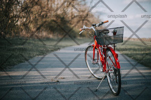
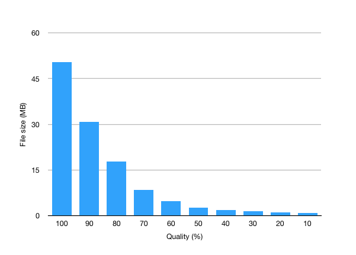

# thumbsup-downsize

> Convert / resize / transcode / down-sample photos & videos to be web-friendly

This is one of the core modules of [thumbsup.github.io](https://thumbsup.github.io).

[](https://npmjs.org/package/thumbsup-downsize)
[](https://github.com/thumbsup/thumbsup-downsize)
[](http://travis-ci.org/thumbsup/downsize)
[](https://david-dm.org/thumbsup/downsize)
[](https://david-dm.org/thumbsup/downsize)
[](http://standardjs.com/)

## Setup

```bash
npm install thumbsup-downsize --save
```

This module requires the following binaries available in the system path, depending on the type of files you need to process:

- [GraphicsMagick](http://www.graphicsmagick.org/) for processing images
- [ImageMagick](https://imagemagick.org/) for HEIC support
- [FFMpeg](https://ffmpeg.org/) for processing videos
- [Gifsicle](http://www.lcdf.org/gifsicle/) for processing animated GIFs

To run the tests, you will also need

- [ExifTool](http://www.sno.phy.queensu.ca/~phil/exiftool/)

## Usage

```js
const downsize = require('thumbsup-downsize')

const options = { height: 100, width: 100 }
downsize.image('source.tiff', 'thumb.jpg', options, (err) => {
  console.log(err || 'Thumbnail created successfully')
})
```

## API

### .image

```js
.image(source, target, options, callback)
```

Processes the image in `source` and creates a new image in `target`.
The image is appropriately converted if needed based on the `target` file extension.
You can specify the following options:

##### Image size

```js
// proportionally resize the photo to a maximum height
opts = { height: 300 }

// proportionally resize the photo to a maximum width
opts = { width: 300 }

// resize and crop the photo to exactly height x width
// the image will not be distorted
opts = { height: 100, width: 100 }
```

##### Image quality

```js
// quality between 0 and 100
opts = { quality: 80 }
```

##### Watermark

You can overlay a transparent watermark over the final image:

```js
opts = {
  watermark: {
    file: 'path/watermark.png',  // transparent PNG
    position: 'NorthEast'        // position of the watermark
  }
}
```

The possible values for `position` are:

- `Repeat` to repeat the watermark across the whole image
- `Center` to position the watermark in the middle
- `NorthWest`, `North`, `NorthEast`, `West`, `East`, `SouthWest`, `South`, `SouthEast` to position the watermark along the edge

 

Note: watermarks are not compatible with cropped images.
The `watermark` option will simply be ignored if both width and height are specified.

##### Post-processing

You can specify extra arguments that will be passed to GraphicsMagick.
This only works with [output arguments](https://github.com/aheckmann/gm#custom-arguments).

```js
opts = {
  args: [
    '-unsharp 2 0.5 0.7 0',
    '-modulate 120'
  ]
}
```

##### GIF animation

By default, only the first frame of an animated GIF is exported.
You can keep the entire animation by specifying:

```js
opts = { animated: true }
```

This offloads the processing of the image to [Gifsicle](https://github.com/kohler/gifsicle).
Note that:

- The destination file extension *must* be `.gif`
- The only other supported parameters are `width` and `height` (e.g. no watermarks)
- Cropping (specifying *both* width and height) is not supported and will throw an error

The flag is simply ignored if the source file is not a GIF.

### .still

```js
.still(source, target, options, callback)
```

Extract a single frame from the video in `source`, and writes the image to `target`.
This method supports all the same options as `.image()`, with the addition of:

```js
opts = {
  // take the screenshot at the very start of the video
  seek: 0
  // take the screenshot after N second (default = 1)
  seek: 1
  // take the screenshot in the middle of the video
  seek: -1
}
```

If seeking fails for any reason, the first frame is used instead.

### .video

```js
.video(source, target, options, callback)
```

Transcodes the video in `source` to a web-friendly format and lower bitrate, and writes it in `target`.
You can specify the following options:

##### Format

The default export format is `mp4`.
You can specify an export format by adding a `format` option:

```js
opts = { format: 'mp4'  } // H264 encoder
opts = { format: 'webm' } // VP9 encoder
```

Note: encoding as `webm` is much slower.

##### Video quality

The default behaviour is to use CRF (constant rate factor) to control the output quality.
The default value is `75%`.

```js
// value between 0 (worst) and 100 (best)
opts = { quality: 75 }
```

Notes:

- the quality scale is not linear
- you will most likely want a value between 50% and 90%
- values over 90% can generate files larger than the original



##### Variable bitrate

Instead of CRF, you can specify a variable bitrate (a.k.a. average bitrate, or target bitrate) by using the `bitrate` option.
Check the [ffmpeg docmentation](https://trac.ffmpeg.org/wiki/Encode/H.264) for more information.
This is not compatible with the `quality` option.

```js
opts = { bitrate: '1200k' }
```

##### Conversion progress

The `.video()` call returns an [EventEmitter](https://nodejs.org/api/events.html)
to follow the progress of the conversion, since it can take a long time.

```js
const emitter = downsize.video(/* ... */)
emitter.on('progress', percent => console.log(`${percent}%`))
```

## Contributing

Image/video resizing is hard to unit test.
Instead, this repo contains an integration test suite made of many different resized files,
covering different file formats and edge cases.

When submitting a change, make sure you run the build locally.

```bash
npm test
```

If you don't have all dependencies installed, you can also run the tests in Docker.

```bash
docker build -t downsize-test .
```
